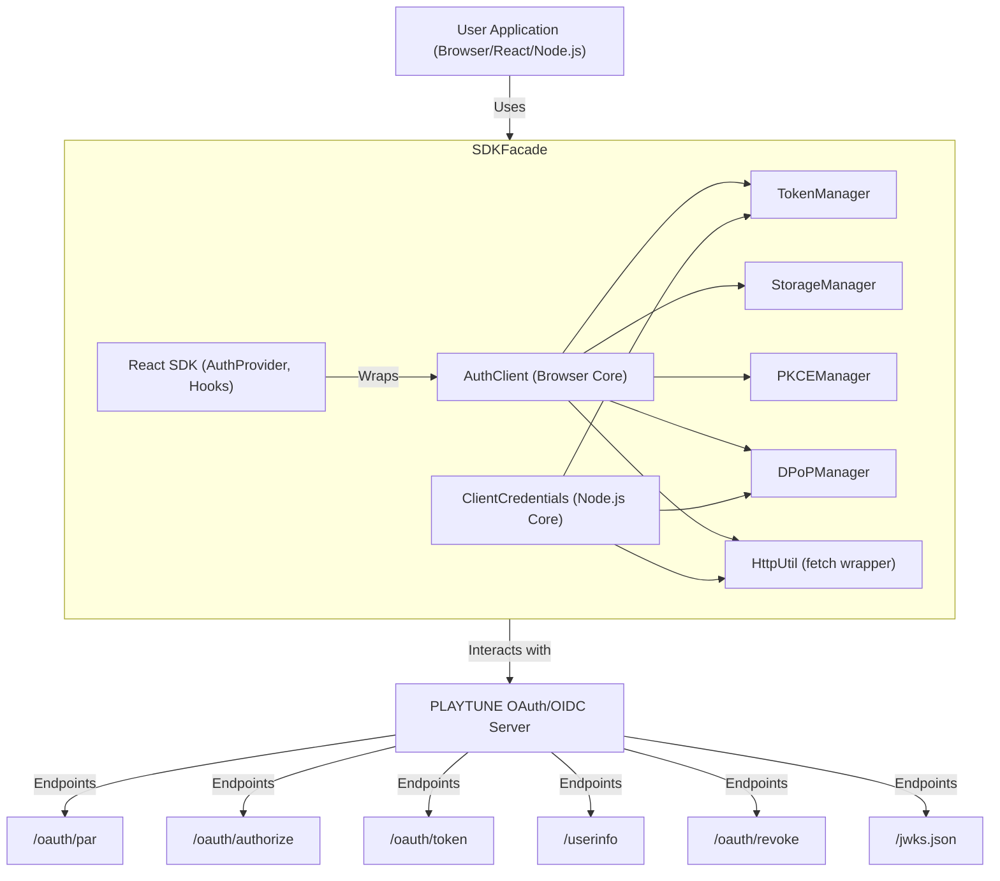

import { Callout } from "@/components/callout"

**Version:** 1.1.0  
**Package:** `@paradigmai/playtune-auth`

## 1. Project Overview

### 1.1 Purpose

`@paradigmai/playtune-auth` は、Paradigm PLAYTUNEプラットフォームのOAuth 2.0 / OpenID Connect (OIDC) 認証機能を、サードパーティのウェブアプリケーションおよびNode.jsアプリケーションに容易に統合するためのTypeScriptベースのSDKです。開発者はこのSDKを利用することで、複雑なOAuthフローの実装詳細を意識することなく、セキュアなユーザー認証と認可処理をアプリケーションに組み込むことができます。

### 1.2 Target Audience

- PLAYTUNE APIを利用してサービスを開発するウェブアプリケーション開発者。
- PLAYTUNEユーザーアカウントでのログイン機能を実装したい開発者。
- Node.js環境でPLAYTUNEのサーバー間認証を利用したい開発者。

### 1.3 Core Technologies & Principles

- **TypeScript**: 静的型付けによる開発効率とコード品質の向上。
- **OAuth 2.0 / OIDC**: 標準プロトコルに準拠。具体的にはAuthorization Code Flow with PKCEを主軸とします。
- **PKCE (Proof Key for Code Exchange)**: RFC 7636。認可コード横取り攻撃を防ぐためのセキュリティ機構。
- **DPoP (Demonstrating Proof-of-Possession)**: RFC 9449。アクセストークンを特定のクライアントに紐付け、トークン盗難時の不正利用リスクを軽減するセキュリティ機構。
- **Modular Design**: 機能ごとにモジュール化（`AuthClient`, `TokenManager`, `StorageManager`など）し、保守性と拡張性を高める。
- **Secure by Default**: セキュリティベストプラクティスをSDK内部で適用。

## 2. Architecture & Design

### 2.1 SDK Architecture

SDKは以下の主要コンポーネントで構成されます。



### 2.2 Design Principles

- **Abstraction**: OAuth/OIDCの複雑なフローを抽象化し、シンプルなAPIを提供。
- **Security First**: PKCE、DPoPをデフォルトで有効化。トークンストレージには暗号化オプション（IndexedDB）を提供。
- **Flexibility**: 設定オプションにより、様々なユースケースに対応（ストレージ選択、スコープ指定など）。
- **Developer Experience**: 包括的な型定義、React用のHooks、Node.js用のヘルパーを提供。
- **State Management**: ブラウザ環境では認証状態をリアクティブに管理し、変更を購読可能にする。

### 2.3 Platform Support

- **Browser**: モダンブラウザをサポート。`AuthClient` がコア機能を提供。
- **React**: `AuthProvider` とカスタムフックにより、Reactアプリケーションへの統合を容易に。
- **Node.js**: `ClientCredentials` クラスにより、Client Credentials Grantを利用したサーバー間認証をサポート。

## 3. Core Components & Implementation Details

### 3.1 AuthConfig (Configuration)

SDKの動作を制御するための設定オブジェクト。

| プロパティ | 型 | 必須 | デフォルト値 (例) | 説明 |
|---|---|---|---|---|
| `clientId` | string | ✔️ | - | PLAYTUNEから発行されたクライアントID。 |
| `clientSecret` | string (optional) |  | - | Confidentialクライアントのシークレット (主にNode.js ClientCredentials用)。ブラウザでは使用不可。 |
| `redirectUri` | string | ✔️ | - | 認可コードを受け取るリダイレクトURI。PLAYTUNEに登録済みのものと一致する必要がある。 |
| `baseUrl` | string (optional) |  | https://account.playtune.jp/v1/api | PLAYTUNE OAuthサーバーのベースURL。 |
| `authorizationEndpoint` | string (optional) |  | [baseUrl]/oauth/authorize | 認可エンドポイント。 |
| `tokenEndpoint` | string (optional) |  | [baseUrl]/oauth/token | トークンエンドポイント。 |
| `userInfoEndpoint` | string (optional) |  | [baseUrl]/userinfo | UserInfoエンドポイント。 |
| `revokeEndpoint` | string (optional) |  | [baseUrl]/oauth/revoke | トークン失効エンドポイント。 |
| `jwksUri` | string (optional) |  | [baseUrl]/jwks.json | IDトークン検証用のJWKS URI。 |
| `logoutEndpoint` | string (optional) |  | [baseUrl]/logout (仮) | ログアウトエンドポイント (IdPセッションも終了する場合)。 |
| `defaultScope` | string (optional) |  | openid profile email offline_access paradigm.role | デフォルトで要求するスコープ。PLAYTUNEの仕様に依存。`offline_access` はリフレッシュトークン取得に必要。 |
| `storage` | "localStorage" \| "sessionStorage" \| "indexedDB" |  | "localStorage" | トークン保存方法。`indexedDB` はAES-GCMで暗号化。 |
| `dpopBoundAccessTokens` | boolean (optional) |  | true | DPoPを利用してアクセストークンをバインドするかどうか。PLAYTUNEサーバーがDPoPを要求する場合 `true`。 |
| `usePkce` | boolean (optional) |  | true | PKCEを利用するかどうか。Authorization Code Flowでは `true` が強く推奨。 |
| `cryptoUtil` | ICryptoUtil (optional) |  | WebCryptoUtil | 暗号化操作（ハッシュ、鍵生成など）を提供するユーティリティ。Node.js環境では別途実装が必要な場合がある。 |

### 3.2 AuthClient (Browser Core)

ブラウザ環境での認証フロー全体を管理する中心的なクラス。

#### Initialization
`AuthConfig` を受け取り、内部マネージャー（TokenManager, StorageManagerなど）を初期化。

#### login(options?: LoginOptions)

1. `usePkce` が `true` の場合、`PKCEManager` を使用して `code_verifier` と `code_challenge` (S256) を生成。`code_verifier` はストレージに保存。
2. `state` (CSRF対策) と `nonce` (OIDCリプレイ攻撃対策) を生成し、ストレージに保存。
3. 認可エンドポイントURLを構築。パラメータには `client_id`, `redirect_uri`, `response_type=code`, `scope`, `state`, `nonce`, `code_challenge`, `code_challenge_method=S256` を含める。
4. Pushed Authorization Requests (PAR) をサポートする場合、まず `/oauth/par` エンドポイントにこれらのパラメータをPOSTし、返された `request_uri` を認可リクエストに使用する。SDKは現在PARを直接サポートしていないが、将来的な拡張ポイント。
5. `window.location.assign()` を使用してユーザーを認可エンドポイントにリダイレクト。

#### handleRedirect()
リダイレクトURIで呼び出される。

1. URLから `code` と `state` を取得。
2. 保存された `state` と比較し、一致しなければエラー。
3. `code`, `redirect_uri`, `grant_type=authorization_code`, `client_id`, 保存された `code_verifier` を用いてトークンエンドポイントにリクエスト。
4. `dpopBoundAccessTokens` が `true` の場合、`DPoPManager` を使用してDPoP証明JWTを生成し、リクエストヘッダー (`DPoP`) に含める。
5. レスポンスからアクセストークン、IDトークン、リフレッシュトークンなどを取得。
6. IDトークンを検証（`nonce` の一致、署名検証は `jwksUri` を使用、有効期限など）。
7. `TokenManager` を使用してトークンをストレージに保存。
8. `userInfoEndpoint` からユーザー情報を取得（アクセストークンを使用、DPoPヘッダーも必要に応じて付与）。
9. ユーザー情報を返し、認証状態を更新。

#### logout()

1. `StorageManager` からローカルトークンを削除。
2. 可能であれば `revokeEndpoint` にアクセストークンやリフレッシュトークンを送信して失効させる（DPoPヘッダーも必要に応じて付与）。
3. IdPのセッションも終了させるために `logoutEndpoint` にリダイレクト（`id_token_hint`, `post_logout_redirect_uri` などのパラメータが必要な場合がある）。
4. 認証状態を更新。

#### getAccessToken()

1. `TokenManager` から現在のアクセストークンを取得。
2. トークンが存在し、有効期限内であればそれを返す。
3. トークンが期限切れまたは存在しない場合、リフレッシュトークンがあれば `refreshToken()` を呼び出す。
4. 成功すれば新しいアクセストークンを返し、失敗すれば `null` を返すかエラーをスロー。

#### refreshToken()

1. `TokenManager` からリフレッシュトークンを取得。
2. リフレッシュトークン、`grant_type=refresh_token`, `client_id`, `scope` を用いてトークンエンドポイントにリクエスト。
3. `dpopBoundAccessTokens` が `true` の場合、DPoP証明JWTを生成しヘッダーに含める。
4. 新しいアクセストークン（および場合によっては新しいリフレッシュトークン）を取得し、`TokenManager` で保存・更新。PLAYTUNEはリフレッシュトークンのローテーションをサポートしている可能性があるため、新しいリフレッシュトークンが返された場合はそれを使用する。

#### State Management

- 内部で `user`, `isLoading`, `error` などの状態を保持。
- `onAuthStateChanged(callback)`: 状態変更時にコールバックを呼び出すリスナー登録機能。

### 3.3 TokenManager

トークンの管理（保存、取得、デコード、検証）を担当。

- **StoredTokens Interface**: SDK内部でトークンを保持する際のデータ構造（アクセストークン、リフレッシュトークン、IDトークン、有効期限、スコープなど）。
- **Token Storage/Retrieval**: `StorageManager` を介してトークンを永続化/読み込み。
- **JWT Decoding**: IDトークンやアクセストークン（JWTの場合）のペイロードをデコードしてクレームを取得。

#### ID Token Validation

- **署名検証**: `jwksUri` から取得した公開鍵を使用。`jose` などのライブラリを利用。PLAYTUNEは ES256 と EdDSA のDual JWSをサポートする可能性がある。
- **iss (Issuer) の検証**: `AuthConfig` の `baseUrl` と一致するか。
- **aud (Audience) の検証**: `AuthConfig` の `clientId` と一致するか。
- **exp (Expiration Time) の検証**: 現在時刻より後か。
- **iat (Issued At) の検証**: 現在時刻より前か（許容範囲を設定）。
- **nonce の検証**: ログイン時に保存した `nonce` と一致するか。

#### Access Token Expiration Check
`expires_in` またはデコードしたJWTの `exp` クレームから有効期限を計算し、現在のアクセストークンが有効か判断。

### 3.4 StorageManager

トークンやPKCEの `code_verifier` などの機密情報を安全に保存・管理。

#### IStorage Interface
`getItem`, `setItem`, `removeItem`, `clear` メソッドを定義。

#### Implementations

- **LocalStorageStore**: `window.localStorage` を使用。
- **SessionStorageStore**: `window.sessionStorage` を使用。
- **IndexedDBStore**: `window.indexedDB` を使用。トークンなどのデータは `cryptoUtil` (Web Crypto API) を用いてAES-GCMで暗号化してから保存。復号化キーは `DPoPManager` が生成・管理するキー（またはそれから派生したキー）を利用するか、SDK初期化時に安全に生成・管理する。

#### Storage Selection
`AuthConfig` の `storage` オプションに基づいて使用するストレージを選択。

### 3.5 PKCEManager

PKCE (RFC 7636) のための `code_verifier` と `code_challenge` を生成・管理。

#### generateCodes()

- **code_verifier**: 高エントロピーのランダムな文字列を生成 (例: 43-128文字)。
- **code_challenge**: `code_verifier` をSHA-256でハッシュ化し、Base64URLエンコードした値を生成 (`code_challenge_method = "S256"` の場合)。
- 生成した `code_verifier` は `handleRedirect` でトークンリクエストに使用するため、`StorageManager` を介して一時的に保存。
- `cryptoUtil` を使用してハッシュ計算。

### 3.6 DPoPManager (RFC 9449)

DPoP証明JWTの生成と関連する鍵ペアの管理。

#### Key Pair Management

- DPoP用の非対称鍵ペア（例: ES256アルゴリズムのECDSA P-256キー）を生成。`cryptoUtil` (Web Crypto API) を使用。
- 公開鍵はJWK形式で保持。
- 秘密鍵は安全に保存。`StorageManager` の `IndexedDBStore` (暗号化付き) を利用するか、セッション中メモリのみで保持（セキュリティトレードオフあり）。PLAYTUNEのドキュメントではDPoPキーペアの自動生成がSDK要件として挙げられている。

#### createProof(httpMethod: string, httpUrl: string, accessToken?: string)

1. DPoP JWTのヘッダー (`typ: "dpop+jwt"`, `alg`, `jwk` (公開鍵JWK)) を設定。
2. DPoP JWTのペイロード (`jti` (ユニークID), `htm` (HTTPメソッド), `htu` (HTTP URL), `iat` (発行時刻)) を設定。
3. アクセストークンを提示する場合（例: リソースアクセス時）、そのアクセストークンのハッシュを `ath` (access token hash) クレームとしてペイロードに含める。
4. 秘密鍵で署名し、Base64URLエンコードされたJWTを生成。
5. 生成されたDPoP証明JWTは、トークンリクエストや保護されたリソースへのリクエスト時に `DPoP` HTTPヘッダーに含める。

### 3.7 React Integration (AuthProvider, Hooks)

#### AuthProvider

- `AuthConfig` を受け取り、内部で `AuthClient` のインスタンスを生成・保持。
- React Context API を使用して `AuthClient` インスタンスと現在の認証状態 (`user`, `isLoading`, `error`) を子コンポーネントに提供。
- `AuthClient` の `onAuthStateChanged` を購読し、状態が変更されたらContextの値を更新して再レンダリングをトリガー。

#### Hooks

- **useAuth()**: Contextから `AuthClient` のメソッド (`login`, `logout`, `getAccessToken` など) と認証状態を取得するためのメインフック。
- **useCurrentUser()**: 現在の `AuthUser` または `null` を返すショートカットフック。
- **useAccessToken()**: アクセストークンとそのローディング状態、手動リフレッシュ関数を返すフック。
- **useAuthenticatedFetch()**: fetch APIのラッパー。自動的に `Authorization: Bearer <token>` ヘッダーと、必要であれば `DPoP` ヘッダーを付与してリクエストを行う。

### 3.8 ClientCredentials (Node.js)

サーバー間認証のためのClient Credentials Grantフローを実装。

#### Configuration
`clientId`, `clientSecret`, `tokenEndpoint`, `defaultScope` が必須。

#### getAccessToken()

1. `grant_type=client_credentials`, `client_id`, `client_secret`, `scope` を用いてトークンエンドポイントにPOSTリクエスト。
2. PLAYTUNEサーバーがClient Credentials Grantに対してもDPoPを要求する場合、`DPoPManager` (Node.js版の暗号ユーティリティが必要) を使用してDPoP証明を生成・添付。
3. アクセストークンを取得し、キャッシュ（有効期限考慮）。

#### makeAuthenticatedRequest(url, options)
取得したアクセストークンを `Authorization` ヘッダーに付与してHTTPリクエストを行うヘルパー。

### 3.9 HttpUtil

fetch APIの薄いラッパー。タイムアウト処理、エラーハンドリング、共通ヘッダー付与などを担当。DPoPヘッダーの付与ロジックもここに集約される場合がある。

## 4. OAuth/OIDC Flow Details with PLAYTUNE

SDKはPLAYTUNEのOAuth/OIDC仕様に準拠して動作します。

### Authorization Code Flow + PKCE
ブラウザベースの認証の標準フロー。

### Token Endpoint

- POSTリクエスト。`Content-Type: application/x-www-form-urlencoded`。
- DPoPヘッダー: `DPoP <signed-dpop-jwt>`。PLAYTUNEはmTLSまたはDPoPを要求。SDKはDPoPを実装。

### UserInfo Endpoint

- GETまたはPOSTリクエスト。
- `Authorization: Bearer <access_token>` または `Authorization: DPoP <access_token>` (DPoPバウンドトークンの場合)。
- DPoPヘッダー: `DPoP <signed-dpop-jwt>` (DPoPバウンドトークンの場合)。

### Refresh Token Grant
`offline_access` スコープが必要。PLAYTUNEはリフレッシュトークンのローテーションをサポートする可能性があるため、レスポンスで新しいリフレッシュトークンが返された場合はそれを使用する。

### Scopes & Claims
`defaultScope` で指定されたスコープに基づき、IDトークンやUserInfoレスポンスに特定のクレームが含まれる。PLAYTUNE固有のクレーム（例: `https://paradigm/role`）も `paradigm.role` のようなスコープで要求可能。

## 5. Security Implementation Details

### PKCE
`code_verifier` をクライアント側で生成し、ハッシュ化された `code_challenge` を認可リクエストで送信。トークンリクエスト時に `code_verifier` を送信することで、IdPはこれらが一致することを確認し、認可コードが途中で盗まれても攻撃者はトークンを取得できない。

### DPoP

1. クライアントはリクエストごとに新しいDPoP証明JWTを生成し、秘密鍵で署名。公開鍵はJWTヘッダーに含める。
2. IdPはDPoP証明を検証し、アクセストークンを発行する際にその公開鍵のハッシュ (`cnf.jkt`) をトークンに含める。
3. リソースサーバーは、アクセストークンと共に提示されたDPoP証明を検証し、トークン内の `cnf.jkt` とDPoP証明の公開鍵ハッシュが一致することを確認。これにより、トークンが正当なクライアントによって使用されていることを保証。

### Secure Token Storage

- **localStorage/sessionStorage**: XSS攻撃に対して脆弱な可能性があるため、注意が必要。
- **IndexedDBStore with AES-GCM encryption**: トークンをクライアントサイドで暗号化することで、XSSで直接トークンが読み取られるリスクを軽減。暗号化キーの管理が重要。Web Crypto API (`crypto.subtle`) を使用。

### State & Nonce
CSRF攻撃およびOIDCリプレイ攻撃を防ぐために、認可リクエストで使用する `state` と `nonce` パラメータを検証。

## 6. Build & Development Process

### Build Tool
`tsup` を使用して、CommonJS (`.js`), ES Modules (`.mjs`), 型定義ファイル (`.d.ts`) を生成。

```json
{
  "scripts": {
    "build": "tsup src/index.ts --format cjs,esm --dts --sourcemap --tsconfig tsconfig.lib.json"
  }
}
```

### TypeScript Configuration

- **tsconfig.json**: Next.js開発用（またはベース設定）。
- **tsconfig.lib.json**: SDKライブラリビルド専用の設定。`noEmit: false`, `declaration: true`, `rootDir: "./src"` など。

### Testing
`vitest` を使用。

- **vitest.setup.ts**: JSDOM環境のセットアップ、localStorage, sessionStorage, indexedDB, crypto APIのモック。
- ユニットテスト、結合テストを記述。`msw` (Mock Service Worker) を利用してAPIリクエストをモック。

### Linting & Formatting
ESLint と Prettier を使用してコード品質と一貫性を維持。

### Publishing
`npm publish` コマンドでnpmレジストリに公開。`package.json` の `files` フィールドで公開するファイルを指定 (`dist` フォルダなど)。`publishConfig: { "access": "public" }`。

## 7. API Reference Summary

主要な公開APIの概要です。詳細な使用方法はユーザー向けドキュメントを参照してください。

### AuthClient

```typescript
class AuthClient {
  constructor(config: AuthConfig)
  login(options?: LoginOptions): Promise<void>
  handleRedirect(): Promise<AuthUser | null>
  logout(): Promise<void>
  getAccessToken(): Promise<string | null>
  getCurrentUser(): AuthUser | null
  getAuthState(): AuthState
  onAuthStateChanged(callback: (state: AuthState) => void): () => void
}
```

### ClientCredentials (Node.js)

```typescript
class ClientCredentials {
  constructor(config: AuthConfig)
  getAccessToken(scope?: string): Promise<string | null>
  makeAuthenticatedRequest(url: string, options?: RequestInit): Promise<Response>
}
```

### React Hooks

```typescript
// via import { ... } from "@paradigmai/playtune-auth"
function AuthProvider(props: AuthProviderProps): JSX.Element
function useAuth(): AuthContextData
function useCurrentUser(): AuthUser | null
function useAccessToken(): { 
  token: string | null
  loading: boolean
  error: Error | null
  refreshToken: () => Promise<string | null> 
}
function useAuthenticatedFetch(): (url: string, options?: RequestInit) => Promise<Response>
```

### Types
`AuthConfig`, `AuthUser`, `AuthState`, `LoginOptions`, `StoredTokens`, `TokenResponse`.

<Callout>
型定義の詳細については、パッケージに含まれる `.d.ts` ファイルを参照してください。
</Callout>

## 8. Future Considerations

### Pushed Authorization Requests (PAR)
RFC 9126 のサポート。認可リクエストパラメータの機密性を向上。

### JWT Secured Authorization Response Mode (JARM)
RFC 9101 のサポート。認可レスポンスの完全性と機密性を向上。

### CI/CD
GitHub Actionsなどを用いたテスト、ビルド、公開の自動化。

### より詳細なエラーコードとハンドリング
SDK利用者向けのエラー特定と対処を容易にする。

### Web Workerでのトークン管理
メインスレッドからトークン処理を分離し、セキュリティとパフォーマンスを向上させる可能性。

---